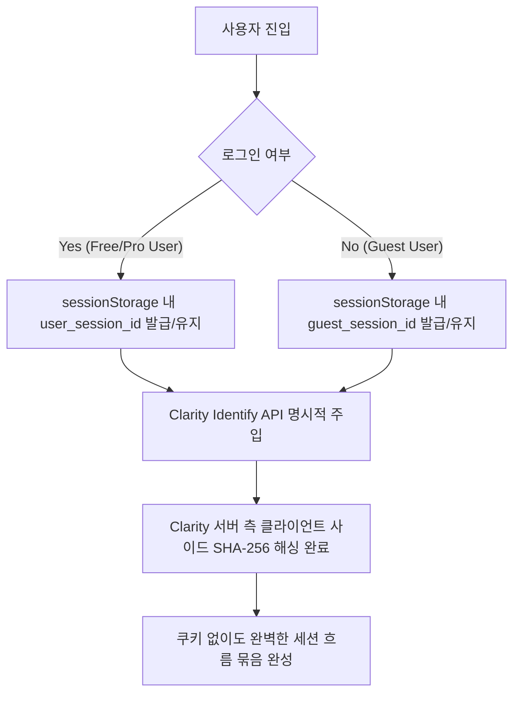

# 트러블슈팅 및 아키텍처 사례 연구: 쿠키 배너 없는 고해상도 Clarity 사용자 분석 시스템 구축

## 1. 배경 및 문제 정의 (Background & Context)
* **목표**: Microsoft Clarity를 도입해 사용자 이벤트(Rage Click, Dead Click, Session Replay)를 분석하고자 함.
* **법적 한계**: GDPR 및 ePrivacy Directive에 따라 분석 도구의 쿠키 생성 시 강제적인 '쿠키 수락 배너'를 띄워야 함.
* **UX 저해**: 배너를 띄우면 사용자의 서비스 진입 UX가 해쳐지며 이탈률이 증가함. 
* **기술적 제약**: Clarity 설정에서 단순히 쿠키를 끄면(Cookies = OFF), 페이지를 이동할 때마다 세션이 끊겨서(No Session Stitching) 사용자 경험 분석 툴로서의 가치가 심각하게 상실됨.

---

## 2. 해결 방안: 자체 세션 식별 아키텍처 (Proposed Architecture)
큐브레인(Cubrain)의 기존 Guest(IP 기반 사용량 카운팅) 및 Free User(DB 연동) 아키텍처 구조에서 힌트를 얻어, **쿠키를 일절 사용하지 않으면서도 클라이언트 세션을 고해상도로 묶어줄 수 있는 자체 세션 관리자**를 개발하여 문제를 해결했습니다.



### 핵심 매커니즘
1. **쿠키 차단 (Strict Privacy Mode)**: Clarity 어드민 설정을 통해 브라우저에 비필수 쿠키(`_clck`, `_clsk` 등)가 생성되는 행위를 원천 차단합니다.
2. **세션 스토리지 활용**: 브라우저 탭 세션 메모리인 `sessionStorage`를 활용합니다. `sessionStorage`는 유저가 탭을 끄면 파괴되므로 영속 추적이 불가능해 GDPR 쿠키법 규제(사용자 기기 정보 영속 읽기/쓰기 동의)를 받지 않는 청정 영역입니다.
3. **Identify API의 Session Stitching 우회**:
   ```javascript
   window.clarity("identify", "custom-user-id", "custom-session-id");
   ```
   Clarity 공식 스크립트가 세션을 식별하도록 자체 발급한 UUID(`custom-session-id`)를 인자로 넣어줌으로써, 쿠키 없이도 페이지 이동 간 세션이 단절되지 않고 하나의 리플레이 파일로 완성되도록 우회했습니다.

---

## 3. 회원 및 게스트 상세 트래킹 로직

| 구분 | 유저 식별값 (`custom-user-id`) | 세션 식별값 (`custom-session-id`) | 추적 동작 범위 및 강도 |
| :--- | :--- | :--- | :--- |
| **회원(Free User)** | `user.current.email` (또는 `user_{id}`) | `sessionStorage` 내 UUID 발급값 유지 | 기기 및 브라우저를 이동하더라도 동일 사용자 여정이 병합되며 완벽한 행동 패턴 파악 가능. |
| **비회원(Guest)** | `"guest"` 고정값 | `sessionStorage` 내 UUID 발급값 유지 | 탭을 열고 사용하는 동안의 여정을 하나의 세션으로 묶어 분석(새로고침 시에도 `sessionStorage` 특성상 세션 유지됨). |

---

## 4. 보안 및 법적 안정성 평가 (Security & Compliance)
* **Zero Cookie**: 브라우저 로컬 기기에 수집 트래커용 쿠키를 남기지 않으므로 ePrivacy Directive 쿠키 배너 의무 위반 소지를 완전히 비껴갑니다.
* **단방향 암호화**: `clarity("identify")` API에 주입되는 식별값은 Microsoft Clarity SDK 내부에서 전송 직전 **SHA-256 단방향 해시**로 무작위 변환되어 전송되므로, 평문 개인정보(이메일 등)가 원본 상태로 제3자 서버에 수집되지 않습니다.
* **사용자 경험 극대화**: 사용자는 그 어떤 귀찮은 쿠키 팝업도 마주하지 않은 채, 모던 웹앱의 심리스한 첫인상을 경험하게 됩니다.

---

## 5. 결론 및 교훈 (Conclusion & Learnings)
타사의 트래킹 솔루션에 세션 유지 기능을 맹목적으로 맡겨두면 쿠키 배너라는 불필요한 UX 장벽을 세워야 합니다. 서비스 아키텍처에 맞는 **자체 세션 발급 방식**과 **Identify API**를 융합하면, 컴플라이언스를 철저히 준수하면서도 트래킹 품질 손실 없이 극상의 웹 UX를 제공할 수 있다는 실증을 보여준 매우 모범적인 리팩토링 사례입니다.
